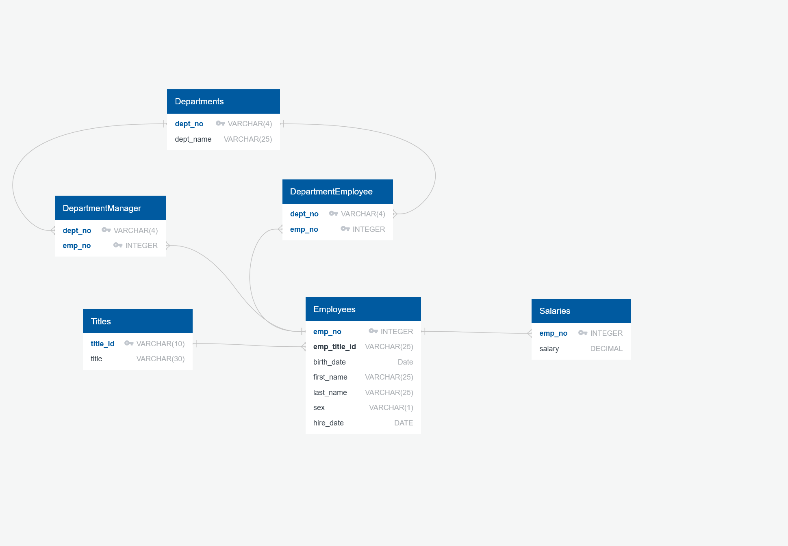

  # SQL Challenge

  ## Description

    A sql challenge to create an erd, create a schema and query the tables using the provided csv data.

  ## Table of Contents 
  - [Screenshots](#screenshots)
  - [Installation](#installation)
  - [Usage](#usage)
  - [License](#license)

  ## Screenshots

    This is the ERD.
  

  ## Installation

    Make sure you have postgres installed.

  ## Usage

    Use the command psql -U postgres and log in with your credentials then \c into an existing db then run the command \i schema.sql and \i queries.sql
  
  ## License 
  ### Badge 
  

    
      MIT License

      Copyright (c) function getFullYear() { [native code] } 
      
      Permission is hereby granted, free of charge, to any person obtaining a copy
      of this software and associated documentation files (the "Software"), to deal
      in the Software without restriction, including without limitation the rights
      to use, copy, modify, merge, publish, distribute, sublicense, and/or sell
      copies of the Software, and to permit persons to whom the Software is
      furnished to do so, subject to the following conditions:
      
      The above copyright notice and this permission notice shall be included in all
      copies or substantial portions of the Software.
      
      THE SOFTWARE IS PROVIDED "AS IS", WITHOUT WARRANTY OF ANY KIND, EXPRESS OR
      IMPLIED, INCLUDING BUT NOT LIMITED TO THE WARRANTIES OF MERCHANTABILITY,
      FITNESS FOR A PARTICULAR PURPOSE AND NONINFRINGEMENT. IN NO EVENT SHALL THE
      AUTHORS OR COPYRIGHT HOLDERS BE LIABLE FOR ANY CLAIM, DAMAGES OR OTHER
      LIABILITY, WHETHER IN AN ACTION OF CONTRACT, TORT OR OTHERWISE, ARISING FROM,
      OUT OF OR IN CONNECTION WITH THE SOFTWARE OR THE USE OR OTHER DEALINGS IN THE
      SOFTWARE.
      

  https://choosealicense.com/licenses/mit/
  

  